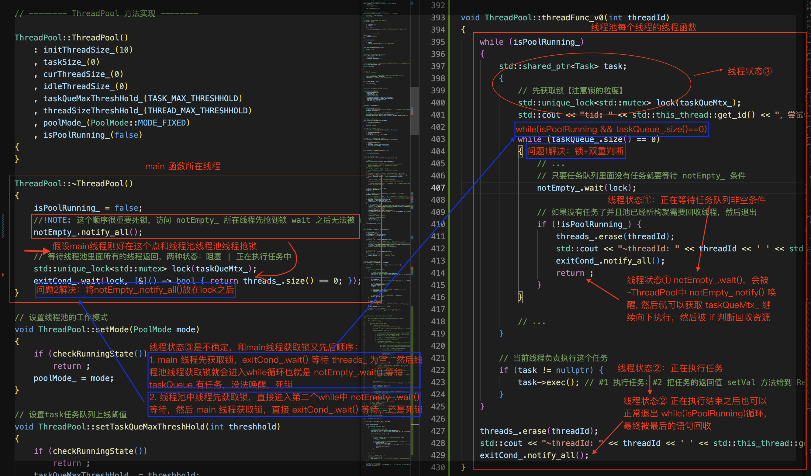
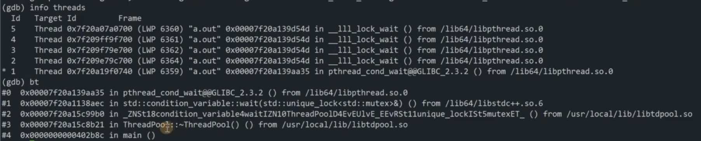
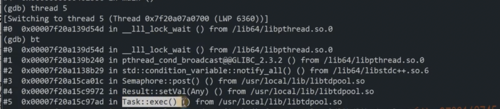

## ThreadPool

C++ 实现 Fix | Cache 模式线程池

### 0-主要技术点

1. C++11/14/17 OOP 的编程思想
2. 组合和继承、多态、STL容器、智能指针、函数对象、**可变参模板（模板+右值引用 -> 万能引用）**
3. 多线程编程，线程同步的互斥锁以及原子操作CAS，线程通信的条件变量和信号量
> unique_lock, cond_.wait, cond_.wait_for
4. 自己实现 C++17 any 以及 C++ 20 semaphore 
5. package_task 打包任务 以及 future 获取返回值优化代码

### 1-难点

#### 1.1 如何设计 Result 接收返回值

**两种设计思想：**
> 注意 Result 的生命周期是长于 task 的
1. `task->getResult()`: 不太合理！因为 task 是一个临时对象，如果析构之后就无法调用 getResult() 了
2. `Result(taskPtr, "true")`: 通过 shared_ptr 监视 task 对象，比较合理

**获取返回值：**
> 返回值只有在 `task->run()` 之后才可以得到，因此考虑如下两个方法完成线程之间通信
- `Any get()`: sem_.wait() 等待 task 执行完之后才有结果，return any
- `void setVal(Any any_)`: 在 task->run() 之后可以 setVal 并且 sem_.post() 通知一下


#### 1.2 如何设计 Cache 模式

**两种模式**
- fixed 模式：线程池里面的线程个数是固定不变的，一般是ThreadPool 创建时根据当前机器的CPU核心数量进行指定。
- cached 模式：线程池里面的线程个数是可动态增长的，根据任务的数量动态的增加线程的数量，但是会设置一个线程数量的阈值 (线程数量不能过多)，任务处理完成，如果动态增长的线程空闲了60s还没有处理其它任务，那么关闭线程，保持池中最初数量的线程即可。

**创建线程**
cached 模式需要根据任务数量和空闲线程的数量，判断是否需要创建新的线程出来，创建新线程的两个条件
1. 任务数量多于空闲线程，即`taskSize_ > idleThreadSize_`
2. 当前线程数量小于上限阈值，即`curThreadSize_ < threadSizeThreshHold_`

创建细节步骤：
1. 创建新的线程对象: ` std::make_unique<Thread>(std::bind(&ThreadPool::threadFunc, this, std::placeholders::_1));`
2. 启动线程: `threads_[threadId]->start();`
3. 修改线程个数相关的变量: `curThreadSize_++; idleThreadSize_ ++;`

**回收线程**
cached模式下，有可能已经创建了很多的线程，但是空闲时间超过60s，应该把多余的线程结束回收掉（超过 initThreadSize_ 数量的线程要进行回收），例如如果当前时间距离上一次线程执行的时间超过 60s 就需要回收

在实现中每 1s 返回一次，通过 wait_for 返回值区分超时返回还是有任务需要执行返回
```cpp
std::cv_status::timeout == notEmpty_.wait_for(lock, std::chrono::seconds(1))
```
回收条件：
1. 当前时间距离上一次线程执行的时间超过 60s，即 `std::chrono::duration_cast<std::chrono::seconds>(now - lastTime).count() >= THREAD_MAX_IDLE_TIME`
2. 现有线程数量大于初始设置线程数量，即 `curThreadSize_ > initThreadSize_`

回收细节：
1. 从线程列表移除: `threads_.erase(threadId);`
2. 维护对应变量: `curThreadSize_ --; idleThreadSize_ --;`
3. return 返回
> 线程函数返回，相应线程也就结束了，另外为了回收指定线程，需要 threadId 指定线程，使用无序的哈希表存储对应关系即可


#### 1.3 ThreadPool 析构回收线程资源

析构时需要等待所有线程执行完毕并返回

### 3-BUG解决

#### 3.1 ThreadPool 析构时死锁问题

**问题复现**


注意线程池线程的三种状态，线程状态 ③ 是不确定，和main线程获取锁有先后顺序：
1. main 线程先获取锁，exitCond_.wait() 等待 threads_ 为空，然后线程池线程获取锁就会进入while循环也就是 notEmpty_.wait() 等待 taskQueue 有任务，没法唤醒，死锁
2. 线程池中线程先获取锁，直接进入第二个while中 notEmpty_.wait() 等待，然后 main 线程获取锁，直接 exitCond_.wait() 等待，还是死锁

如何调试？
- Windows VS 调试线程调用堆栈
- Linux gdb 调试多线程, attach 调用堆栈 (**似乎在MacOS上不会出现这个问题...**)

**问题解决**

1. 问题1可以通过「锁+双重检测」的方式避免，然后还可以进一步优化代码（去重）
2. 问题2可以将 notEmpty_.notify_all() 放在 lock() 后面，可以通知先获取的锁线程池中线程

具体参考 [threadpool 析构时死锁问题](https://github.com/EricPengShuai/threadpool/commit/9634ed0a38aa7c940348be8857fb45e552e257f9)


#### 3.2 Result 析构时不同平台死锁问题

**问题复现**
查看线程调用堆栈


切换到指定阻塞线程再查看


**问题解决**

VS编译器中 mutex 和 condition_variable 析构时会自动释放对应资源
```cpp
_Mutex_base(int _Flags = 0) noexcept
{   // construct with _Flags
    _Mtx_init_in_situ(_Mymtx(), _Flags | _Mtx_try);
}

~_Mutex_base() noexcept
{   // clean up
    _Mtx_destroy_in_situ(_Mymtx());
}

~condition_variable() noexcept
{   // destroy
    _Cnd_destroy_in_situ(_Mycnd());
}
```

MinGW编译器中 mutex 和 condition_variable 析构时不做任何事情
```cpp
~mutex() = default;

~condition_variable() noexcept;
```

在 Semaphore 中添加 isExit_ 变量控制 condition_variable 和 mutex 的存活状态，具体参考 [解决[Linux]Result 析构时死锁问题|[MacOS]system_error: mutex lock failed](https://github.com/EricPengShuai/threadpool/commit/263ba95b4280d7177bd75d3e7f1ef27234b65e03)

#### 3.3 MacOS mutex 问题
**问题复现**
```bash
libc++abi: terminating due to uncaught exception of type std::__1::system_error: mutex lock failed: Invalid argument
```

- [libc++abi.dylib: terminating with uncaught exception of type std::__1::system_error: mutex lock failed: Invalid argument](https://stackoverflow.com/questions/66773247/libcabi-dylib-terminating-with-uncaught-exception-of-type-std-1system-er)
- [uncaught exception of type std::__1::system_error: mutex lock failed: Invalid argument](https://github.com/apache/mxnet/issues/309)

**问题解决**
似乎也是 GCC 的问题？


### 4-应用点

#### 高并发网络服务器
moduo 网络库 IO 线程和业务线程分离

#### master-slave线程模型

Master线程用来分解任务，然后给各个 Slave 线程分配任务，等待各个 Slave 线程执行完任务返回结果，Master 线程通过 result.get() 异步获取各个任务结果并输出 

#### 耗时任务处理


### ToDo

- [ ] gdb 调试多线程，大秦坑王博客
- [ ] 整理 future 以及 package_task 机制


### 5-参考

1. [线程的查看以及利用gdb调试多线程](https://blog.csdn.net/zhangye3017/article/details/80382496)
2. [C++11 - thread多线程编程，线程互斥和同步通信，死锁问题分析解决](https://blog.csdn.net/QIANGWEIYUAN/article/details/88792621)

